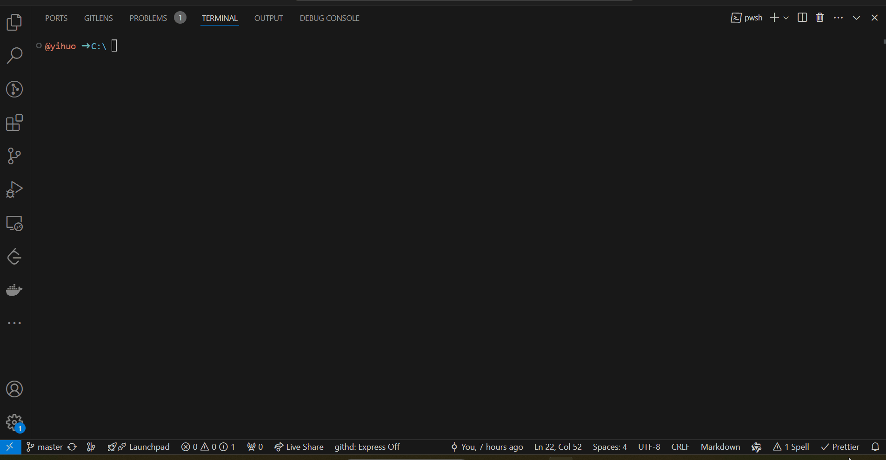

# ECAD-Viewer

<p>
    中文 |<a href="README.md">English<a/>
</p>

基于 [kicanvas](https://github.com/theacodes/kicanvas) 的交互式在线电子设计查看器。

演示链接: https://www.eda.cn/ecadViewer/

## 为什么新建一个仓库，而不往 KiCanvas 提PR？

我们欢迎引入现成的框架，而不是像原项目那样坚持做一个无依赖的库

在保持可复用组件的同时，ECAD-Viewer 提供以下开箱即用的功能，其中一些功能并不在KiCanvas作者的规划中：

-   **通用功能**:

    -   基于 KiCad 进行深度二次开发，以支持导入Altium 设计，及从kicad_pcb生成3D模型
    -   支持从 ZIP 文件加载项目
    -   保持对最新KiCad文件格式的支持

-   **PCB**:

    -   可以选择并显示 VIA 和 ZONE 的属性
    -   当选择网络/元件封装时，其他区域变灰
    -   选择优先级：Track -> Pad/Drill -> Footprint -> Zone。当重叠时，提供弹出菜单进行选择
    -   提供设置通孔类型焊盘的透明度的入口
    -   Fab Layer 显示元件封装文本
    -   单击选中器件，双击选中网络
    -   对于处于选中状态的网络上的导线，按照其所在铜层的预设颜色进行渲染
    -   显示的导线的宽度和颜色属性

-   **SCH**:

    -   查看符号和子图属性
    -   点击相同名称的标签之间互相跳转
    -   添加 hierarchical_labels
    -   修复从 AD 转换的 SCH 图纸
    -   原理图预览，并通过预览图切换原理图
    -   跳转到指定的原理图，聚焦并选中指定符号
    -   点击显示导线、总线、引脚、符号和标签的属性
    -   悬停时高亮显示导线、总线、引脚、符号和标签

-   **3D**:

    -   与kicad-cli-docker集成，从PCB生成 3D 模型，且生成过程中优先使用项目根目录下的封装3D模型
    -   使用 gltfpack 压缩模型，以节省带宽及提高渲染效率
    -   集成Three.js，展示3D模型

-   **BOM**:

    -   从原理图生成物料清单 (BOM)
    -   从原理图中提取 BOM
    -   优先从原理图中提取BOM，没有原理图时，从PCB中提取BOM

-   **开发和反馈过程中的一些 bug 修复**:

    -   SCH 中的图纸引脚位置不正确
    -   解析 从AD 转换的 SCH 中的 ALTIUM_VALUE 属性
    -   从AD导入的PCB设计中 封装信息的错乱
    -   即便将焊盘的透明度调到最小，也仅仅只是颜色变浅，不会完全消失
    -   添加了悬停时高亮导线的开关
    -   PCB元件封装文本位置和角度混乱
    -   当焊盘所在层处于隐藏状态时，不显示焊盘


## 快速开始

我们准备了完整版（包含所有kicad官方3D模型，镜像尺寸要大得多）和精简版docker镜像供您尝试，可以通过以下命令下载 docker 镜像：

```bash
# 取消下面的注释以拉取完整版本
# docker pull registry.cn-shanghai.aliyuncs.com/kicad/ecad-viewer:full
# 精简版
docker pull registry.cn-shanghai.aliyuncs.com/kicad/ecad-viewer:lite
```

然后启动容器:

```bash

# 取消注释下面的以运行完整版本
# docker run --rm -p 7676:7676 -p 8989:8989 -p 8012:8012  registry.cn-shanghai.aliyuncs.com/kicad/ecad-viewer:full
# 运行精简版
docker run --rm -p 7676:7676 -p 8989:8989 -p 8012:8012 registry.cn-shanghai.aliyuncs.com/kicad/ecad-viewer:lite

```

打开 http://localhost:8012 查看项目运行效果


## 本地开发

从 https://nodejs.org/en/download/ 下载并安装 NodeJS（版本 >= 18）

```bash
git https://github.com/Huaqiu-Electronics/ecad-viewer.git
cd ecad-viewer
npm install
npm run serve
```

修改代码并打开 http://localhost:8080 验证修改

## 使用

### 单独使用

```html
<ecad-viewer cli_server_addr="http://localhost:8989/convert_ad_to_kicad">
    <ecad-source src="video/video.kicad_pcb"></ecad-source>
    <ecad-source src="video/video.kicad_sch"></ecad-source>
    <ecad-3d-source src="video/video.glb"></ecad-3d-source>
</ecad-viewer>
<script type="module" src="./ecad_viewer/ecad-viewer.js"></script>
<script>
    window.addEventListener("pcb:board_content:ready", function (event) {
        // URL of the API endpoint
        const convert_pcb_to_glb_url =
            "http://localhost:8989/convert_pcb_to_glb";
        fetch(convert_pcb_to_glb_url, {
            method: "POST",
            headers: {
                "Content-Type": "application/json",
            },
            body: JSON.stringify({
                pcb_content: event.detail,
            }),
        })
            .then((response) => {
                return response.json(); // Parse response JSON
            })
            .then((data) => {
                window.dispatchEvent(
                    new CustomEvent("3d:url:ready", { detail: url }),
                );
            });
    });
</script>
```

参数说明：

-   `cli_server_addr`：用于将AD设计转换为KiCad的服务URL
-   `ecad-source`：HTML自定义标签，`src`为Kicad或AD设计的URL
-   `ecad-3d-source`：HTML自定义标签，`src`为3D模型的URL
-   `convert_pcb_to_glb_url`：用于将KiCad PCB转换为3D模型的服务URL

查看完整示例 [Standalone example](debug/index.html)

### 内嵌模式

```html
<body>
    <ecad-viewer-embedded url="video/video.kicad_pcb"> </ecad-viewer-embedded>
    <ecad-viewer-embedded url="video/video.glb"> </ecad-viewer-embedded>
    <ecad-viewer-embedded
        url="video/video.kicad_sch;
      video/bus_pci.kicad_sch">
    </ecad-viewer-embedded>
    <ecad-viewer-embedded
        is-bom="true"
        url="video/video.kicad_sch;
      video/bus_pci.kicad_sch">
    </ecad-viewer-embedded>
</body>
<script type="module" src="./ecad_viewer/ecad-viewer.js"></script>
```

参数说明：

-   `url`：KiCad或AD的设计的URL（多个URL以分号分隔）
-   `is-bom`：如果设置为 true，嵌入式查看器将显示BOM而不是原理图

查看完整示例 [Embedded example](debug/embedded.html)

### kicad-cli server

将AD设计转换为KiCad，以及从PCB生成3D模型都需要kicad-cli。

#### kicad-cli docker image

基于华秋开发维护的 [Kicad分支](https://github.com/Huaqiu-Electronics/kicad) 制作的 [docker镜像](https://github.com/orgs/Huaqiu-Electronics/packages/container/package/kicad)

```bash
# 打包了所有kicad官方3D模型的镜像
docker pull registry.cn-shanghai.aliyuncs.com/kicad/kicad:full

# 不包含3D模型的镜像
docker pull registry.cn-shanghai.aliyuncs.com/kicad/kicad:lite
```

#### kicad-cli-python

[kicad-cli-python](https://github.com/Huaqiu-Electronics/kicad-cli-python) 是打包了kicad-cli命令行工具并对外提供服务的python项目，拉取了上述kicad-cli docker镜像之后，您可以执行以下命令启动文件服务和kicad-cli服务：

```bash
git clone https://github.com/Huaqiu-Electronics/kicad-cli-python.git
cd kicad-cli-python
pip install -r ./requirements.txt
# 开启文件服务和kicad-cli服务
python file_srv.py
python cli_srv.py
```

## Credits

该项目包含副本或使用其他作品。这些作品及其各自的许可和条款是：

-   [kicanvas](https://github.com/theacodes/kicanvas) 基于 [MIT license](https://github.com/theacodes/kicanvas/blob/main/LICENSE.md)
-   [three-gltf-viewer](https://github.com/donmccurdy/three-gltf-viewer) 基于 [MIT license](https://github.com/donmccurdy/three-gltf-viewer/blob/main/LICENSE)
